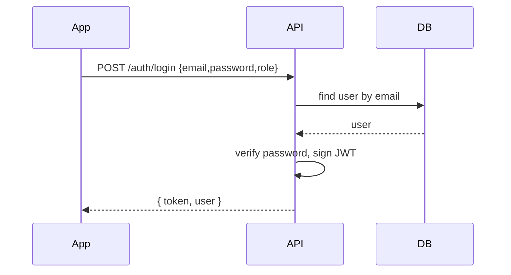
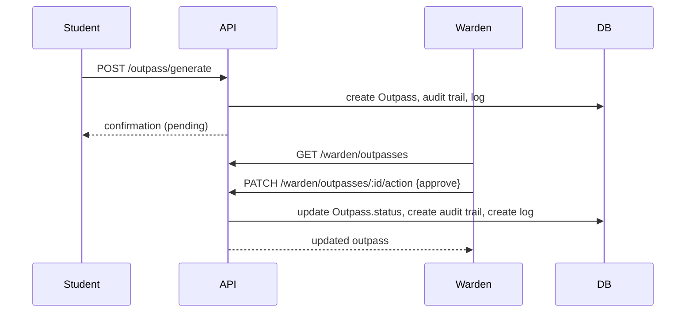

# Aegis ID — Software Requirement Specification (Updated)

Generated from repository analysis (backend + frontend) — reflects implemented features as of commit in workspace.

Date: 2026-05-08

---

## 1. Introduction

- **Name:** Aegis ID — Digital campus identity & campus services platform
- **Purpose:** This SRS documents the actual implementation present in the repository, covering frontend (React Native / Expo), backend (Node.js, Express, Prisma), database schema (PostgreSQL via Prisma), APIs, middleware, and implemented workflows (outpass, emergency, SAC, library, security/guard scanning).
- **Scope:** Mobile-first app for students, wardens, security staff and administrators to manage access, outpasses, SAC & library activity, and emergency alerts. Does not include external government ID integration. The SRS focuses only on implemented functionality (no speculation).

## 2. Project Overview

- Frontend: React Native (Expo), code in [frontend](frontend)
- Backend: Node.js + Express + Prisma, code in [backend](backend)
- Database: PostgreSQL (Prisma schema at [backend/prisma/schema.prisma](backend/prisma/schema.prisma#L1))
- Authentication: JWT tokens, stateless API authentication, role-based access in middleware
- Primary modules: auth, student, admin, warden, security, outpass, emergency, sac, library

## 3. User Roles & Permissions (implemented)

Roles are defined in Prisma enum `UserRole` in [backend/prisma/schema.prisma](backend/prisma/schema.prisma#L1-L40): `student`, `warden`, `security`, `admin`.

- `student`
  - Responsibilities: Request outpasses, generate/view today's outpass, trigger emergency alerts, claim/release library seats, join/leave SAC rooms, take/return SAC equipment, view and update own profile.
  - Permissions: create outpass (`POST /outpass/generate`), view own outpass (`GET /outpass/today`, `GET /outpass/history`), emergency alert (`POST /emergency/alert`), library actions, SAC actions, update profile (`PUT /auth/profile`), student password OTP flow (`/student/password-update/*`).
  - Accessible screens: Dashboard, Outpass, CreateOutpass, Emergency, Library, SAC, Profile, Scanner (self-logging), Logs.

- `warden`
  - Responsibilities: Approve/reject/cancel hostel outpasses, view hostel monitoring & dashboard, view/inspect outpass details.
  - Permissions: warden dashboard (`GET /warden/dashboard`), list/inspect outpasses (`GET /warden/outpasses`, `GET /warden/outpasses/:id`), act on outpass (`PATCH /warden/outpasses/:id/action`), monitoring (`GET /warden/monitoring`).
  - Accessible screens: WardenDashboard, WardenOutpassScreen, WardenMonitoringScreen.

- `security`
  - Responsibilities: Scan QR codes / log entry-exit events, create movement logs for students, view security logs.
  - Permissions: security log endpoints (`POST /security/log`, `POST /security/student-log`), view security logs (`GET /security/logs`).
  - Accessible screens: GuardScreen, ScannerScreen, Security register UI.

- `admin` (includes mapped `sac_admin` and `library_admin` on login)
  - Responsibilities: System-level dashboards, student listings, logs, hostel stats, emergency administration and status updates, library admin actions, SAC admin equipment returns.
  - Permissions: admin dashboard (`GET /admin/dashboard/stats`), manage students (`GET /admin/students`, `PUT /admin/students/:id/status`), system logs (`GET /admin/logs`), emergency admin endpoints (`GET /emergency/admin/*`, `PUT /emergency/admin/:id/status`), library admin seat release (`POST /library/admin/release-seat`), SAC admin actions in [sacRoutes](backend/routes/sacRoutes.js).
  - Accessible screens: Admin dashboards (frontend `SACAdminScreen`, `LibraryAdminScreen`, `Warden`/Admin views mapped to `admin` role).

Notes:

- Frontend supports role aliases at login: `sac_admin` and `library_admin` are normalized to `admin` by `AuthContext`.

## 4. Functional Requirements (Implemented)

This section lists features present in code (grouped, with implementation status).

- Authentication & User Management (Implemented)
  - User registration (`POST /auth/register`) — [backend/routes/authRoutes.js](backend/routes/authRoutes.js#L1-L200)
  - Login (`POST /auth/login`) — returns JWT token; token expiry controlled by env var.
  - Profile fetch & update (`GET/PUT /auth/profile`) with role-specific profile upsert.
  - Password reset via email (`POST /forgot`) — simple random password and email.
  - Student password update via OTP email flow (`/student/password-update/*`) — implemented.

- Outpass Management (Implemented)
  - Student request generation with validation (`POST /outpass/generate`) — regular and long_visit types; includes audit trail and logging. [backend/routes/outpassRoutes.js](backend/routes/outpassRoutes.js#L1-L120)
  - Student view today/history (`GET /outpass/today`, `GET /outpass/history`).
  - Student cancellation (`PUT /outpass/:id` with status=cancelled).
  - Warden approval/rejection/cancellation (`PATCH /warden/outpasses/:id/action`).
  - Warden monitoring and dashboard endpoints (`GET /warden/dashboard`, `GET /warden/monitoring`).
  - Automatic expiry job invoked on read flows: `expireOldOutpasses` updates statuses to `expired` when expectedReturnDate < now.

- Security / Gate Scanning & Movement Logs (Implemented)
  - Guard scanning flow: `POST /security/log` (guards) — verifies outpass usage for exits and entries, writes `Log` and `OutpassAuditTrail` changes when applicable.
  - Student self-logging (guard QR) `POST /security/student-log`.
  - Log list for guards `GET /security/logs` with range filters.

- Emergency Alerts (Implemented)
  - Create alert (`POST /emergency/alert`) — accepts location (lat/lon), media, and creates Emergency, EmergencyMedia and Log records.
  - User emergency history (`GET /emergency/my-alerts`), admin views (`GET /emergency/admin/*`) and status update (`PUT /emergency/admin/:id/status`).

- Student Activity: SAC (Implemented)
  - Overview (`GET /sac/overview`, `/sac/status`).
  - Join/open/leave club rooms (`POST /sac/rooms/:roomName/select` and `/leave`).
  - Take/return equipment (`POST /sac/equipment/:name/select`, `/return`).

- Library Seat Management (Implemented)
  - Check status (`GET /library/status`) and overview (`GET /library/overview`).
  - Claim seat (`POST /library/claim-seat`) and release seat (`POST /library/release-seat`).
  - Admin release (`POST /library/admin/release-seat`).

- Logging & Auditing (Implemented)
  - `Log`, `OutpassAuditTrail`, `EmergencyMedia`, `PasswordUpdateOtp` models and related entries are created across operations.

Partially implemented / scaffolded features

- Blockchain audit logging: referenced as a concept in earlier SRS but not implemented in codebase — marked as Planned/Placeholder.
- Push notifications / realtime websockets: no websocket server or push infrastructure found; frontend polls and uses HTTP APIs. Failover for API hosts implemented client-side (secondary base URL), but no push or websockets in repo.

Deprecated / removed: none detected; some legacy fields retained in Prisma comments.

## 5. Database Design (models and fields)

Source: Prisma schema at [backend/prisma/schema.prisma](backend/prisma/schema.prisma#L1-L300).

Primary entities (summary) — full model definitions available in the Prisma file.

- `User` (table `users`)
  - Fields: `id:String (PK)`, `name:String`, `email:String (unique)`, `passwordHash`, `role:UserRole` (student|warden|security|admin), `gender`, `department`, `year`, `hostel`, `roomNumber`, `phoneNumber`, `emergencyContact`, `profilePhoto`, `studentId`, `guardId`, `isActive`, `createdAt`, `updatedAt`.
  - Relations: `studentProfile`, `wardenProfile`, `securityProfile`, `emergencies`, `outpasses`, `logs`, etc.

- `StudentProfile` (student_profiles)
  - Fields: `userId (PK, FK->User)`, `studentId (unique)`, `department`, `year`, `hostel`, `roomNumber`, timestamps.

- `WardenProfile`, `SecurityProfile` — role-specific metadata with `hostel` or `guardId`.

- `Outpass` (outpasses)
  - Fields: `id`, `userId (FK)`, `reason`, `destination`, `outDate`, `expectedReturnDate`, `actualReturnDate`, `requestType` (regular|long_visit), `status` (pending|approved|rejected|expired|cancelled), `approvedById`, `rejectionReason`, emergency contact fields, timestamps.
  - Relations: `auditTrail` (OutpassAuditTrail), `user`, `approvedBy`.

- `Emergency` and `EmergencyMedia` — stores lat/lon as Decimal(9,6), status enum (active/responded/resolved), priority, respondedBy.

- `Log` — movement and system logs. Key fields: `userId`, `action` (many enumerated actions), `location`, `guardId`, `deviceInfo`, `ipAddress`, `success`, `details (Json)`, `scanType` (qr|nfc|manual), `createdAt`.

- SAC models: `SacRoomSession`, `SacRoomPresence`, `SacEquipmentCheckout` — used for room open/close and equipment checkout sessions.

- `LibrarySeatSession` — seat number, enteredAt, leftAt, lastActivityAt.

Entity relationships (ER-style description):

- `User (1) -- (M) Outpass` (owner) — a user may have many outpasses.
- `Outpass (1) -- (M) OutpassAuditTrail` — audit of approvals/rejections.
- `User (1) -- (M) Log` — user has many logs.
- `User (1) -- (M) Emergency` — emergencies raised by user.
- `SacRoomSession (1) -- (M) SacRoomPresence` — session to presence mapping.

Indexes and constraints derived from Prisma: many `@@index` entries in schema, unique constraints on email, studentId, guardId.

## 6. API Documentation (grouped)

All routes live under `backend/routes`. Below are the main endpoints with method, path, auth requirement, and brief request/response notes. Use the actual route files for implementation details (e.g. [backend/routes/outpassRoutes.js](backend/routes/outpassRoutes.js#L1-L120)).

Auth Module

- POST /auth/register — Public. Body: user details (name,email,password,role and role-specific fields). Response: token + user.
- POST /auth/login — Public. Body: email,password,role(optional). Response: token + user.
- GET /auth/profile — Authenticated. Response: current user.
- PUT /auth/profile — Authenticated. Body: updatable profile fields; role-specific upsert of profiles.
- GET /auth/fetchProfile?user=<id|json> — Public. Fetch arbitrary profile by id.

Student Module

- GET /student/profile — Authenticated. Student profile fetch (alias to auth/profile in some places).
- PUT /student/profile — Authenticated. Update student fields.
- POST /student/password-update/request-otp — Authenticated (student only). Body: newPassword, confirmPassword. Triggers OTP email.
- POST /student/password-update/verify-otp — Authenticated (student only). Body: otp. Applies pending password.
- PUT /student/passwordUpdate — Authenticated (non-student password change with current password).
- GET /student/logs — Authenticated (student only). Query params: page,limit.

Outpass Module

- POST /outpass/generate — Authenticated, authorize student. Body: purpose/destination/fromDate/fromTime/toDate/toTime OR other aliases. Creates Outpass, OutpassAuditTrail, Log.
- GET /outpass/history — Authenticated (student). Query params: status,limit,requestType.
- GET /outpass/today — Authenticated (student). Returns today's outpass summary.
- PUT /outpass/:id — Authenticated (student). Supports cancellation only (status=cancelled).

Warden Module

- GET /warden/dashboard — Authenticated, authorize warden. Returns hostel stats and active monitoring.
- GET /warden/outpasses — Authenticated, authorize warden. Query: status, monitoringState, page.
- GET /warden/outpasses/:id — Authenticated, authorize warden. Outpass details.
- PATCH /warden/outpasses/:id/action — Authenticated, authorize warden. Body: action=approve|reject|cancel and remarks.
- GET /warden/monitoring — Authenticated, authorize warden. Hostel monitoring list.

Security Module

- POST /security/log — Authenticated, role security required. Body: action, location, userId or studentId, guardId/guardName. Creates movement log and may update outpass usage.
- POST /security/student-log — Authenticated. Only students (self-logging) allowed for guard QR.
- GET /security/logs — Authenticated, security role required. Query params: location,search,rangePreset,page,limit.

Emergency Module

- POST /emergency/alert — Authenticated. Body: type, location or latitude/longitude, media array, emergencyContactCalled flag. Creates Emergency + media + log.
- GET /emergency/my-alerts — Authenticated. Paged emergency list for user.
- GET /emergency/history — Authenticated alias.
- Admin: GET /emergency/admin/active, GET /emergency/admin/all, PUT /emergency/admin/:id/status, GET /emergency/admin/stats — Admin-only operations.
- GET /emergency/contacts — Authenticated. Returns configured emergency contacts and personal contact.

SAC Module

- GET /sac/status, GET /sac/overview — Authenticated.
- POST /sac/rooms/:roomName/select — Authenticated, student allowed. Joins or opens room session.
- POST /sac/rooms/:roomName/leave — Authenticated, student allowed.
- POST /sac/equipment/:equipmentName/select — Authenticated, student allowed.
- POST /sac/equipment/:equipmentName/return — Authenticated, SAC admin only (checked via `isSacAdministrator`).

Library Module

- GET /library/status, GET /library/overview — Authenticated.
- POST /library/claim-seat — Authenticated, authorize student.
- POST /library/release-seat — Authenticated, authorize student.
- POST /library/admin/release-seat — Authenticated, admin scope check via `isLibraryAdministrator` utility.

Admin Module

- GET /admin/dashboard/stats — Authenticated + adminAuth (admin or security). Returns counts: totalStudents, pendingOutpasses, activeEmergencies, todayLogs.
- GET /admin/students — Authenticated + adminAuth. List students with filters.
- GET /admin/students/:id — Authenticated + adminAuth. Student detail + recent logs/outpasses/emergencies.
- GET /admin/logs — Authenticated + adminAuth. System logs filters.
- PUT /admin/students/:id/status — Authenticated + adminAuth. Toggle isActive.

Middleware & Auth Flow

- `authenticate` middleware reads `Authorization: Bearer <token>`, verifies via `verifyToken` in [backend/config/jwt.js] (not shown here), fetches user from DB, attaches `req.user` (serialized), rejects invalid/expired tokens. [backend/middleware/auth.js](backend/middleware/auth.js#L1-L120)
- `authorize(...roles)` middleware checks `req.user.role` and returns 403 if not allowed.
- `adminAuth` is a simple middleware allowing role `admin` or `security`.

Request / Response formats: use JSON bodies. Many endpoints return { message, <resource> } objects. See route files for per-endpoint schemas.

## 7. System Architecture

High level:

- Mobile clients (Expo React Native) communicate over HTTPS with Node/Express API.
- Backend uses Prisma to access PostgreSQL (datasource provider in Prisma config).
- No real-time socket server in repository — flows are request/response and DB-driven.

Mermaid: Authentication flow



Mermaid: Outpass approval flow



## 8. Frontend Architecture

- Entry: `App.js` / `index.js` (Expo) — sets up navigation, providers.
- Providers: `AuthProvider` ([frontend/context/AuthContext.js](frontend/context/AuthContext.js#L1-L120)), `LocationContext.js`, `ScreenshotContext.js`, `ThemeContext.js`.
- API layer: `frontend/services/api.js` — centralized axios instance, token injection via AsyncStorage, failover to secondary API base URL logic.
- Navigation: React Navigation (stack and tab flows). Screens found under [frontend/screens](frontend/screens).
- State: Contexts + local screen state; AsyncStorage used for persisted token & user data.

Frontend screens mapping (representative)

- `LoginScreen.js`, `RegisterScreen.js`, `LoadingScreen.js` — authentication and onboarding.
- `OutpassScreen.js`, `CreateOutpass` (screen file exists), `WardenOutpassScreen.js` — outpass flows.
- `EmergencyScreen.js`, `ScannerScreen.js` — emergency & scanning.
- `SACScreen.js`, `SACAdminScreen.js`, `LibraryScreen.js`, `LibraryAdminScreen.js` — activity modules.
- `GuardScreen.js` — guard-specific UI for scanning.

Components

- Reusable components under [frontend/components](frontend/components): `OutpassCard`, `EmergencyButton`, `LoadingSpinner`, `FilterTabs`, `ScanResultCard`, `RoomCard`, `QuickStatsCard`, `WardenMonitoringCard`, etc.

API usage patterns

- The mobile app calls domain APIs via `outpass`, `emergencyAPI`, `warderAPI / wardenAPI`, `sacAPI`, `libraryAPI` modules. Responses are merged into screen state; polling/refresh flows exist (e.g., useFocusEffect in OutpassScreen).

## 9. Backend Architecture

- Server: `server.js` in [backend/server.js](backend/server.js) (main express bootstrapping) — mounts routers in `backend/routes`.
- DB access: `getPrismaClient()` from [backend/config/prisma.js] used everywhere.
- JWT config: [backend/config/jwt.js] (verifyToken used in auth middleware).
- Utilities: many domain helpers under `backend/utils` (outpassLifecycle.js, locationPolicy.js, campusActivityRules.js, libraryActivity.js, sacCatalog.js, mailer.js, passwordOtp.js).
- Middleware: `authenticate` (JWT), `authorize` (RBAC), `adminAuth`, `outpassExpiry`.

Deployment & Docker

- Backend includes [backend/Dockerfile] and composition under `backend/compose.yaml` — Docker-based deployment scaffolding exists. Root `docker-compose.yml` also present.
- Frontend has `Dockerfile` and `builApk.ps1` script for building APKs locally.

## 10. Authentication & Authorization

- JWT tokens issued at login and registration by `authRoutes` using `process.env.JWT_SECRET`, and expiry by `process.env.JWT_EXPIRE`.
- `authenticate` middleware validates token and attaches serialized user (`serializeUser`) to `req.user`.
- `authorize(...roles)` checks role membership.
- Admin endpoints use `adminAuth` which allows `admin` or `security` roles in this codebase.

Refresh tokens: no long-lived refresh token flow found; only short JWT expiry and token stored on client. Frontend removes stored token on 401 responses.

## 11. Security Features

- Passwords hashed using `bcrypt` (10 rounds) — see [backend/routes/authRoutes.js](backend/routes/authRoutes.js#L1-L80) and [backend/routes/studentRoutes.js].
- JWT authentication via `verifyToken`/`sign` functions.
- Input validation: routes include ad-hoc server-side validation (required fields, normalized enums). No central schema validation library (e.g., Joi) detected.
- Device binding: user model has `studentId`, `guardId`, `hostel` fields; no explicit device fingerprint binding or mobile device registration token exists in current code.
- Outpass token security: outpasses are server-side records; QR payloads scanned by guards contain userId/studentId; no cryptographic signed QR payload generation code found — QR is used primarily to carry identifiers (security area: could be improved).
- Rate limiting, helmet, CORS: not found in route code; no express-rate-limit or helmet middleware present in repository (recommendation: add).
- Email OTP: used for student password update flow; OTP stored hashed in DB (`PasswordUpdateOtp`) with expiry.

Security gaps / notes:

- No refresh-token flow — tokens are single JWTs; client removes token on 401.
- No explicit rate-limiting middleware found — consider adding to protect auth and emergency endpoints.
- QR payloads not cryptographically signed in backend; guards rely on `studentId`/`userId` and DB checks.

## 12. Workflows & Use Cases (sequence summaries)

- Outpass request and approval: Student -> POST /outpass/generate -> Warden reviews -> PATCH action -> status change logged.
- Gate scan exit: Guard scans QR -> POST /security/log -> guard route checks approved outpasses for exit window -> marks outpass used and logs outpass_used.
- Emergency alert: Student -> POST /emergency/alert (lat/lon media) -> Emergency & Media records created and admin can change status.

## 13. Component Library & Screens (frontend)

- Key components: `OutpassCard`, `QuickStatsCard`, `WardenMonitoringCard`, `ScanResultCard`, `EmergencyButton`.
- Screens: see [frontend/screens](frontend/screens) — each implements API calls in `frontend/services/api.js` and uses `AuthContext` for token.

## 14. Deployment & DevOps

- Dockerfiles present for backend and frontend; `docker-compose.yml` at repo root and `backend/compose.yaml` provide local container orchestration.
- No CI/CD workflows (GitHub Actions, Azure pipelines) detected in repository.

## 15. Non-Functional Requirements (inferred)

- Performance: endpoints implement pagination and limits; outpass expiry and movement lookups use indexed fields. Expected latency suitable for mobile REST clients; p95 target not explicitly measured.
- Scalability: Prisma/Postgres horizontally scalable through DB hosting; no stateless sessions, so horizontal scaling of backend possible behind load balancer.
- Reliability: No retry/backoff in server; client includes failover between API base URLs.
- Observability: `Log` model records many actions; no dedicated metrics/monitoring stack found.

## 16. Risks & Constraints

- QR security: unsafely trusting identifiers in QR payloads can be spoofed — recommend signing QR payloads.
- No global rate limiting or WAF in repo — auth/emergency endpoints at risk of abuse.
- Token expiry without refresh workflow may force re-login and affect UX.

## 17. Appendix A — Prisma Schema Highlights

See full schema in [backend/prisma/schema.prisma](backend/prisma/schema.prisma#L1-L300).

Example: `Outpass` model (excerpt):

```prisma
model Outpass {
  id String @id @db.VarChar(24)
  userId String @map("user_id") @db.VarChar(24)
  reason String @db.VarChar(500)
  destination String @db.VarChar(500)
  outDate DateTime @map("out_date")
  expectedReturnDate DateTime @map("expected_return_date")
  requestType OutpassRequestType @default(regular) @map("request_type")
  status OutpassStatus @default(pending)
  approvedById String? @map("approved_by") @db.VarChar(24)
  createdAt DateTime @default(now()) @map("created_at")
}
```

## 18. Appendix B — Route List (files)

- [backend/routes/authRoutes.js](backend/routes/authRoutes.js#L1-L200)
- [backend/routes/outpassRoutes.js](backend/routes/outpassRoutes.js#L1-L120)
- [backend/routes/wardenRoutes.js](backend/routes/wardenRoutes.js#L1-L120)
- [backend/routes/securityRoutes.js](backend/routes/securityRoutes.js#L1-L120)
- [backend/routes/emergencyRoutes.js](backend/routes/emergencyRoutes.js#L1-L120)
- [backend/routes/sacRoutes.js](backend/routes/sacRoutes.js#L1-L120)
- [backend/routes/libraryRoutes.js](backend/routes/libraryRoutes.js#L1-L120)
- [backend/routes/adminRoutes.js](backend/routes/adminRoutes.js#L1-L120)

## 19. Future Scope (code-observed suggestions)

- Add cryptographically signed QR payloads / short-lived passkeys (to prevent copying/spoofing).
- Add refresh-token flow to improve UX and security.
- Add rate limiting and helmet/express best-practices middleware.
- Add push notification / websocket integration for real-time emergency alerts and warden notifications.
- Add CI pipeline and monitoring stack (Prometheus/Grafana, Sentry) and automated DB migrations in deployment.

---
